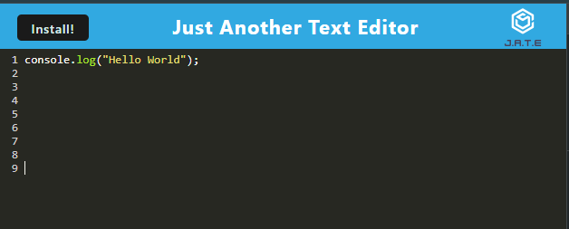

# Just Another Text Editor (JATE)

## Description

Just Another Text Editor (JATE) is a progressive web application (PWA) aimed at providing a simple yet powerful text editing experience. It was built as a practice project to learn and demonstrate the usage of webpack for bundling and managing dependencies.

The motivation behind JATE was to create a lightweight and efficient text editor that can be accessed from any device with a web browser. By building this project, I aimed to enhance my understanding of webpack and improve my skills in web development.

JATE solves the problem of needing a text editor on-the-go without the need for installing additional software. 

Through the development of JATE, I learned how to effectively use webpack to bundle JavaScript modules, manage assets, and optimize performance for web applications.

## Table of Contents

- [Installation](#installation)
- [Usage](#usage)
- [Credits](#credits)
- [License](#license)

## Installation

To install JATE, follow these steps:

1. Clone the repository to your local machine.
2. Navigate to the project directory.
3. Run `npm install` to install dependencies.
4. Run `npm run build` to build the project with webpack.
5. Deploy the built files to a web server or host the application locally.

## Usage

- Deployed URL [JATE](https://just-another-text-editor-okfw.onrender.com/)

To use JATE, simply open it in a web browser. You can perform the following actions:

- Emulate a JavaScript development environment with syntax highlighting
- Install the app on your computer
- Access JATE offline and continue editing documents.

## Credits
- Starter Code by [Coding Bootcamp](https://github.com/coding-boot-camp)
- Challenge Completed by [Nick Smith](https://github.com/nicklearning)

## License

This project is licensed under the [MIT License](LICENSE).

## Features

- Responsive design for mobile and desktop devices.
- Offline support using service workers.

## How to Contribute

If you would like to contribute to JATE, please follow these guidelines:

1. Fork the repository.
2. Create a new branch for your feature or bug fix.
3. Commit your changes with descriptive commit messages.
4. Push your branch to your forked repository.
5. Submit a pull request to the main repository's `develop` branch.

